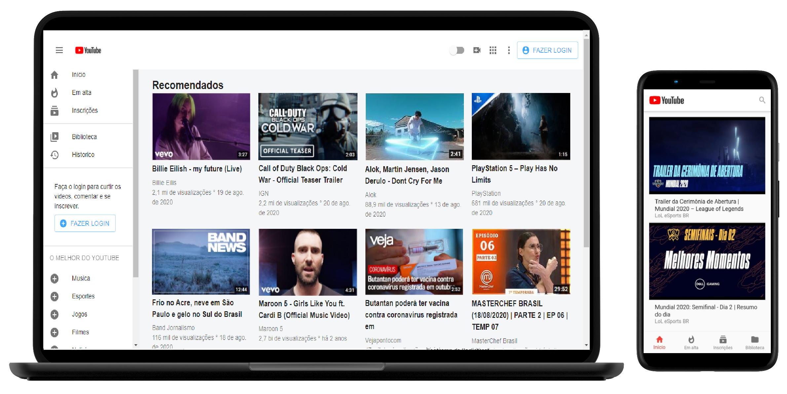

<h1 align="center">
  
</h1>
<p align="center">
  
  
  
  
  <a href="https://github.com/GabrielSouzaCampos/youtube-clone/commits/master">
    
  <!--  -->
  </a>
  <!--  -->
 <br>
  <a href="https://www.linkedin.com/in/gabrielsouzacampos/">
       
  </a> 
  <!-- <a href="https://insomnia.rest/run/?label=happy&amp;uri=https%3A%2F%2Fraw.githubusercontent.com%2GabrielSouzaCampos%2Fhappy%2Fmaster%2F.github%2FInsomnia.json" target="_blank"></a> -->
</p>
<strong>
<br>
<p align="center">
    <a href="README.md">English</a>
    ·
    <a href="README-pt.md">Portuguese</a>
</p>

<p align="center">
  <a href="#bookmark-about">About</a>&nbsp;&nbsp;&nbsp;|&nbsp;&nbsp;&nbsp;
  <a href="#computer-technologies">Technologies</a>&nbsp;&nbsp;&nbsp;|&nbsp;&nbsp;&nbsp;
  <a href="#wrench-tools">Tools</a>&nbsp;&nbsp;&nbsp;|&nbsp;&nbsp;&nbsp;
  <a href="#package-installation">Installation</a>&nbsp;&nbsp;&nbsp;|&nbsp;&nbsp;&nbsp;
  <a href="#memo-license">License</a>
</p>
</strong>
<br>

<p align="center">
    
</p>

## :bookmark: About

This project was made for educational purposes, being a clone of the Youtube UI.

<br>

## :computer: Technologies

-  **[Javascript](https://developer.mozilla.org/en-US/docs/Web/javascript)**
-  **[Material UI](https://material-ui.com/pt/)**
-  **[ReactJS](https://reactjs.org/)**
-  **[Flutter](https://flutter.dev/)**
-  **[Youtube API](https://developers.google.com/youtube/v3/)**

<br>

## :wrench: Tools

- **[VisualStudio Code](https://code.visualstudio.com/)**
- **[Google Chrome](https://www.google.com/chrome/)**

<br>

## :package: Installation

### :heavy_check_mark: **Prerequisites**

The following software must be installed:
  
  - **[Node.js](https://nodejs.org/en/)**
  - **[Git](https://git-scm.com/)**
  - **[NPM](https://www.npmjs.com/)** or **[Yarn](https://yarnpkg.com/)**
  - **[Android Studio](https://developer.android.com/studio)**

<br>
  
### :arrow_down: **Cloning the repository**

```sh
  $ git clone https://github.com/GabrielSouzaCampos/youtube-clone.git
```

<br>

### :arrow_forward:	**Running the applications**

- :computer: Web app

```sh
  $ cd web
  # Dependencies install.
  $ yarn # or npm install
  # Running web app
  $ yarn start # or npm start
```

- :iphone: Mobile app

```sh
  $ cd mobile
  # Dependencies install.
  $ flutter pub dev
  # Running mobile app
  $ flutter run
```

<br>

## :memo: License

This project is under the **MIT** license.


